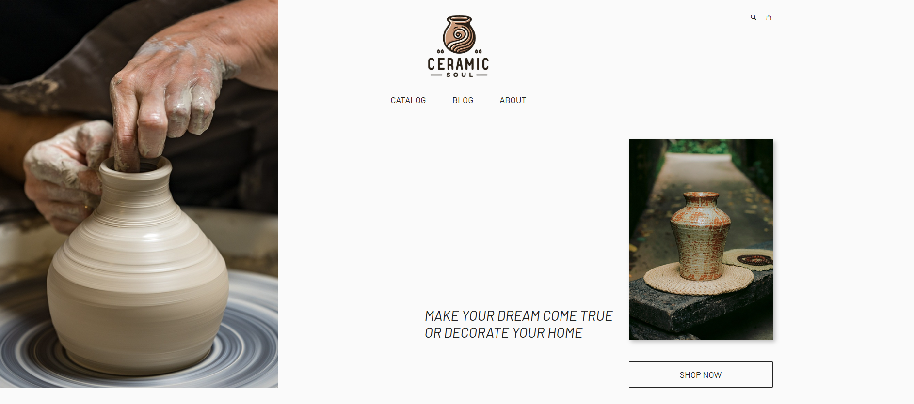
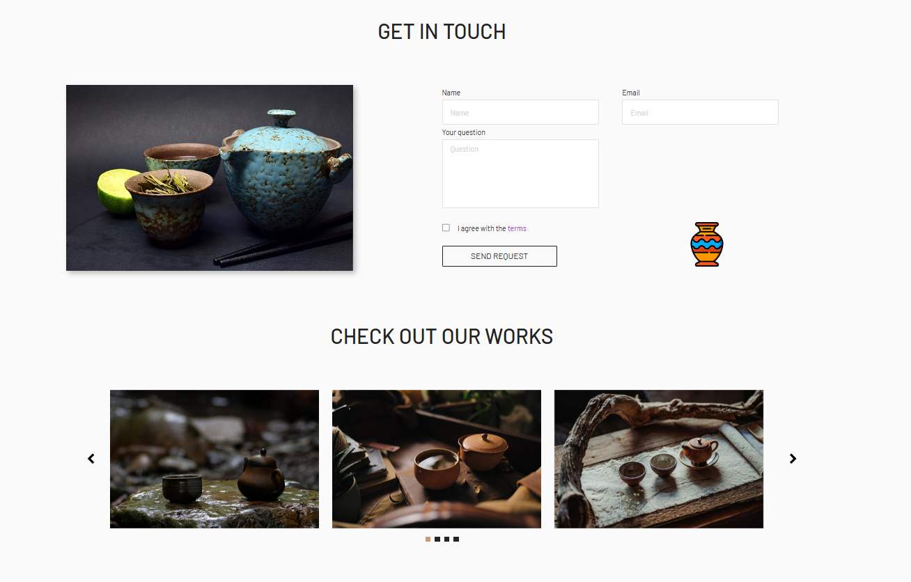
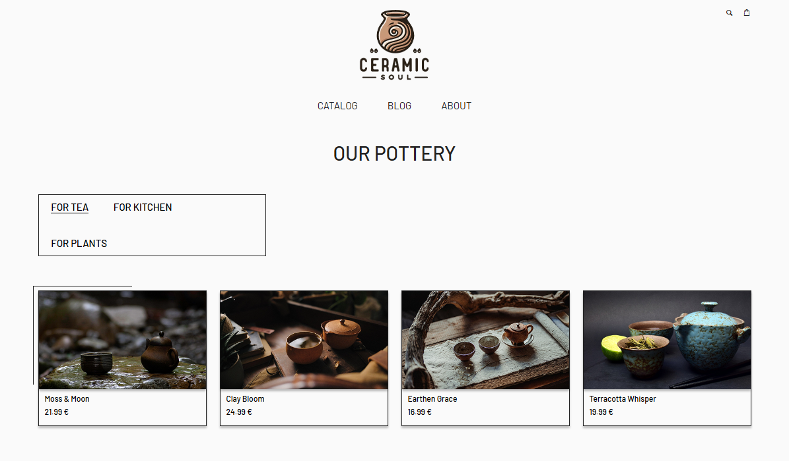
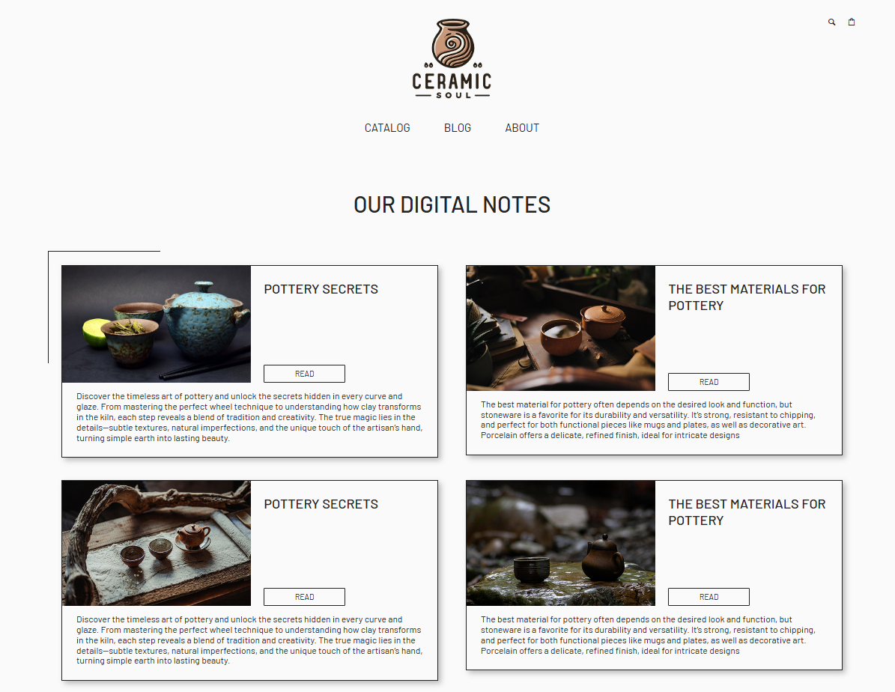

# Ceramic Store Website

A modern, multi-section website for a fictional ceramic products store.  
This project was developed as part of frontend learning, based on a pre-designed static layout with advanced UI elements.

🔗 **Live demo**: [https://mal3v14.github.io/ceramic-store-site/](https://mal3v14.github.io/ceramic-store-site/)

---

## 📸 Preview

  
  
  
  

---

## ⚙️ Tech Stack

- **HTML5**
- **SCSS / CSS3**
- **JavaScript (ES6+)**
- **Vite**
- Responsive layout
- BEM methodology
- Semantic and accessible markup

---

## 📌 About the project

This ceramic store website was built as a practice project to improve frontend development skills using a modern toolchain and component-based styling.  
The layout and functionality were implemented based on a static design from a training course.

Key goals:
- Responsive and mobile-friendly UI
- Clean, modular SCSS structure
- Maintainable and semantic code
- Fast development workflow with Vite

---
